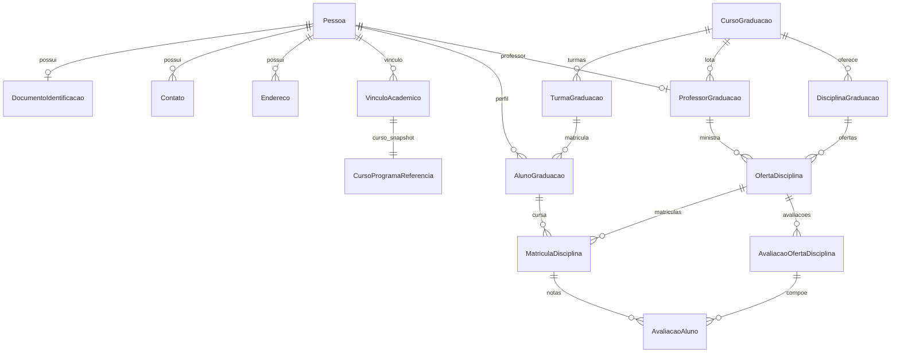
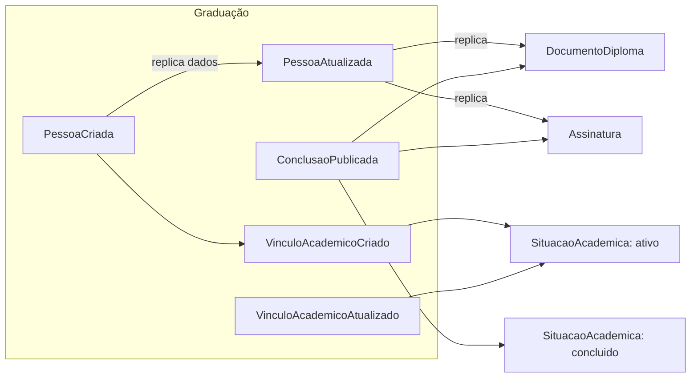

# Serviço de Graduação

## Entidades
- Pessoa (owner primário se adotado), DocumentoIdentificação, Contato, Endereço
- VínculoAcadêmico (pessoa + curso referenciado via `CursoProgramaReferencia`)
- AlunoGraduação (matrícula por turma)
- ProfessorGraduação
- CursoGraduação, DisciplinaGraduação, TurmaGraduação, OfertaDisciplina
- MatrículaDisciplina, AvaliaçãoOfertaDisciplina, AvaliaçãoAluno
- SituaçãoAcadêmica (enum de status para vínculo e aluno)
- DocumentoOficialGraduação (documentos oficiais emitidos pela graduação)

## Regras de Negócio da Simulação
- Criação e atualização de `AlunoGraduacao` e `ProfessorGraduacao` criam/atualizam o `VinculoAcademico` correspondente.
- Mudança de status do vínculo (trancado, desligado, concluído) atualiza a situação acadêmica.
- Status `CONCLUIDO` exige `dataConclusao` preenchida no vínculo/aluno (ver [pendências](../pendencias.md) para o que ainda falta reforçar no banco).
- Notas e avaliações ficam em `MatriculaDisciplina`/`AvaliacaoAluno`; não são replicadas fora.
- Documento oficial é solicitado na Graduação e encaminhado ao fluxo de assinatura: via banco em A1, via banco em A2 (pendente), e por composição de serviços em A3.

## Replicação por Arquitetura

### Diretriz de paridade
Todas as entidades compartilhadas devem ser replicadas da mesma forma entre serviços, seja por tabela (A1/A2) ou por eventos (A3). Qualquer divergência do objetivo está listada em [Pendências](../pendencias.md).

### A1 - DB Based (replicação via banco)
- `graduacao.pessoa` -> `pos_graduacao.pessoa`, `diplomas.pessoa`, `assinatura.pessoa`
- `graduacao.documento_identificacao` -> `pos_graduacao.documento_identificacao`, `diplomas.documento_identificacao`, `assinatura.documento_identificacao`
- `graduacao.contato` -> `pos_graduacao.contato`, `diplomas.contato`, `assinatura.contato`
- `graduacao.endereco` -> `pos_graduacao.endereco`, `diplomas.endereco`, `assinatura.endereco`
- `graduacao.vinculo_academico` -> `diplomas.vinculo_academico`, `assinatura.vinculo_academico`
- `graduacao.documento_oficial_graduacao` -> fluxo de assinatura no banco (`documento_oficial`, `documento_assinavel`, `solicitacao_assinatura`)

### A2 - CDC + Kafka (replicação por tabela capturada)
- `graduacao.pessoa` -> `pos_graduacao.pessoa`, `diplomas.pessoa`, `assinatura.pessoa`
- `graduacao.vinculo_academico` -> `diplomas.vinculo_academico`, `assinatura.vinculo_academico`
- Fluxo de documento oficial para assinatura no A2: previsto, ainda em implementação

### A3 - EDA + Kafka (eventos ainda a implementar)
- `PessoaCriada`, `PessoaAtualizada`
- `VinculoAcademicoCriado`, `VinculoAcademicoAtualizado`
- `ConclusaoPublicada`
- `DocumentoOficialCriado`, `DocumentoOficialAtualizado`
- `SolicitacaoAssinaturaCriada`, `SolicitacaoAssinaturaCancelada`
- `AssinaturaParcial`, `AssinaturaConcluida`, `AssinaturaRejeitada`

## Diagrama de Entidades

## Fluxo de Eventos e Read Models (A3 - planejado)

