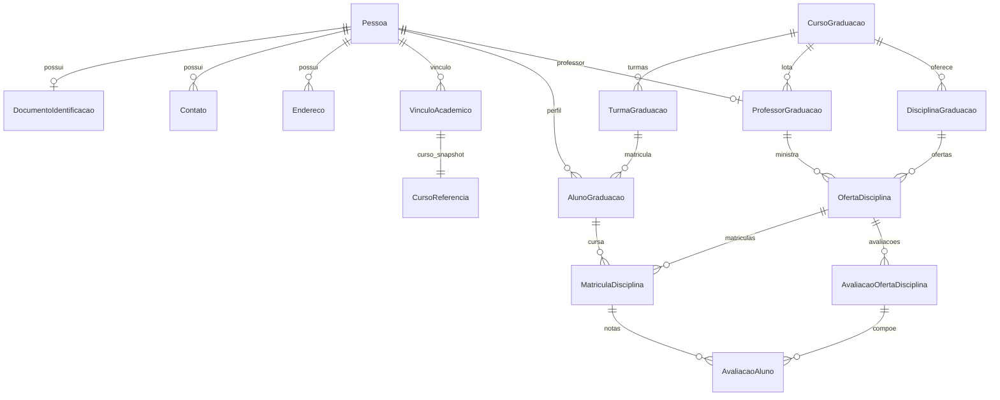
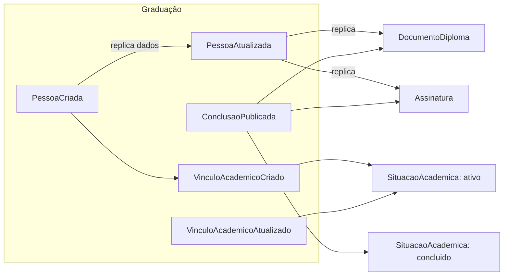

# Serviço de Graduação

## Entidades
- Pessoa (owner primário se adotado), DocumentoIdentificação, Contato, Endereço
- VínculoAcadêmico (pessoa + curso referenciado via `CursoReferencia`)
- AlunoGraduação (matrícula por turma)
- ProfessorGraduação
- CursoGraduação, DisciplinaGraduação, TurmaGraduação, OfertaDisciplina
- MatrículaDisciplina, AvaliaçãoOfertaDisciplina, AvaliaçãoAluno
- SituaçãoAcadêmica (enum de status para vínculo e aluno)
- DocumentoOficialGraduação (documentos oficiais emitidos pela graduação)

## Regras de Negócio da Simulação
- Criação de Pessoa e do VínculoAcadêmico (status inicial ativo) emite eventos `PessoaCriada` e `VinculoAcademicoCriado`.
- Atualizações de contato/endereço emitem `PessoaAtualizada` (replicação em outros serviços).
- Mudança de status do vínculo (trancado, reaberto, desligado, concluído) emite `VinculoAcademicoAtualizado`; status concluído emite também `ConclusaoPublicada` com `vinculoId`.
- Status `CONCLUIDO` exige `dataConclusao` preenchida no vínculo/aluno.
- Notas e avaliações ficam em `MatriculaDisciplina`/`AvaliacaoAluno`; não são replicadas fora.
- Documento oficial criado/atualizado gera fluxo de assinatura (`DocumentoAssinavel` + `SolicitacaoAssinatura`).
- Consome eventos de Diploma/Assinatura apenas para read models locais opcionais (`DocumentoDiploma`, `Assinatura` cópias).

## Diagrama de Entidades

## Fluxo de Eventos e Read Models

