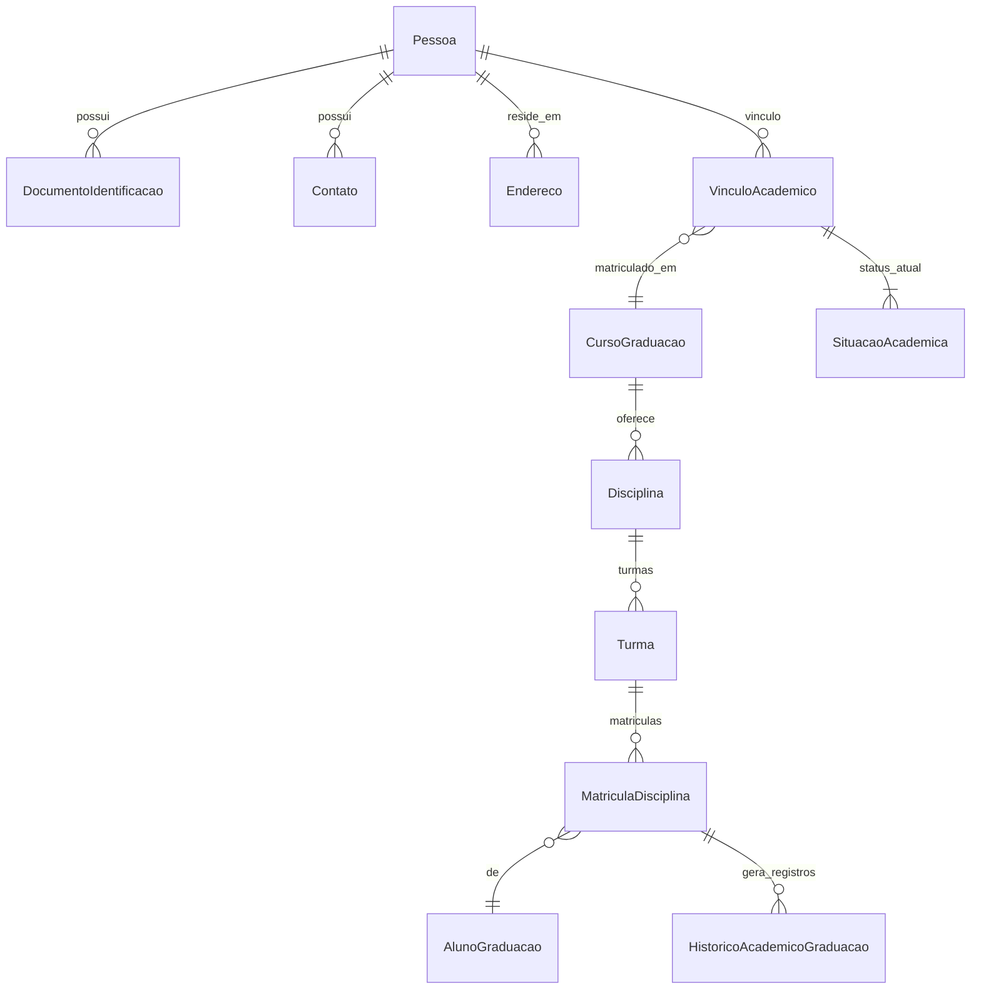
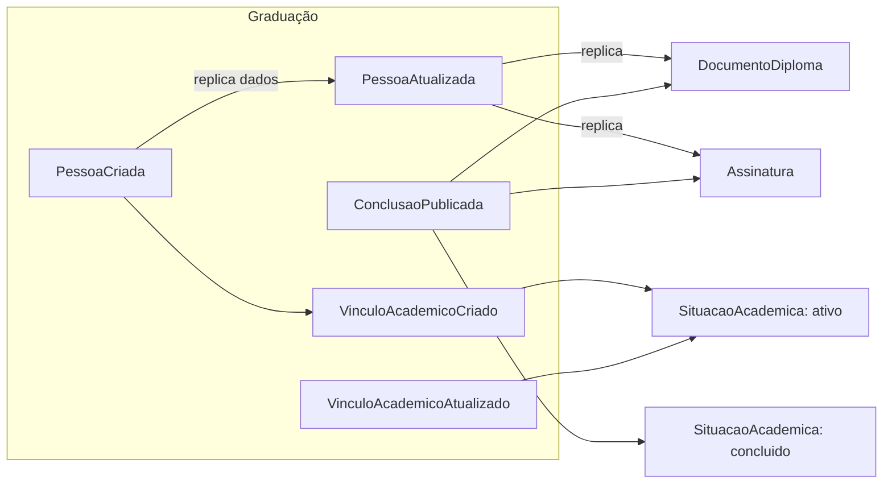

# Serviço de Graduação

## Entidades
- Pessoa (owner primário se adotado), DocumentoIdentificacao, Contato, Endereco
- AlunoGraduacao (perfil acadêmico)
- CursoGraduacao
- VinculoAcademico (origem=grad) — vínculo unificado por pessoa/curso
- Disciplina, Turma, MatriculaDisciplina
- HistoricoAcademicoGraduacao
- SituacaoAcademica (projeção do vínculo, status atual)

## Regras de Negócio da Simulação
- Criação de Pessoa e do VinculoAcademico (origem=grad, status=ativo) emite eventos `PessoaCriada` e `VinculoAcademicoCriado`.
- Atualizações de contato/endereço emitem `PessoaAtualizada` (replicação em outros serviços).
- Mudança de status do vínculo (trancado, reaberto, desligado, concluído) emite `VinculoAcademicoAtualizado`; status concluído emite também `ConclusaoPublicada` com `academicLinkId`.
- Notas/frequência geram registros em Historico; não são replicados fora, apenas agregam carga de escrita.
- Consome eventos de Diploma/Assinatura apenas para read models locais opcionais (`DocumentoDiploma`, `Assinatura` cópias).

## Diagrama de Entidades

## Fluxo de Eventos e Read Models

