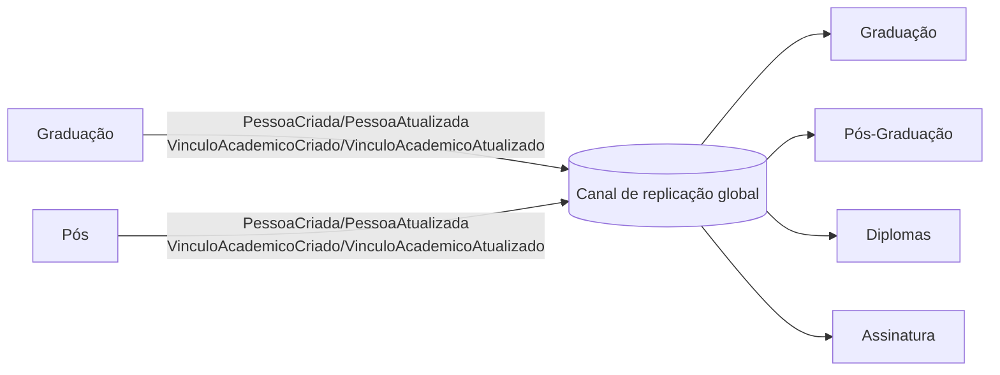
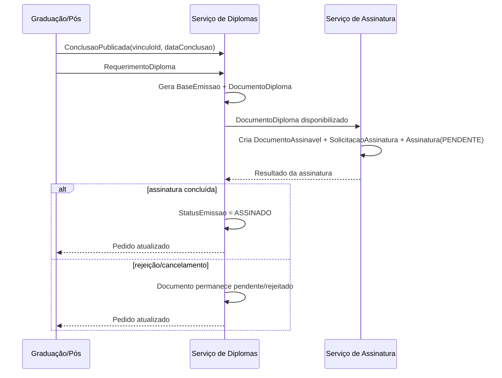
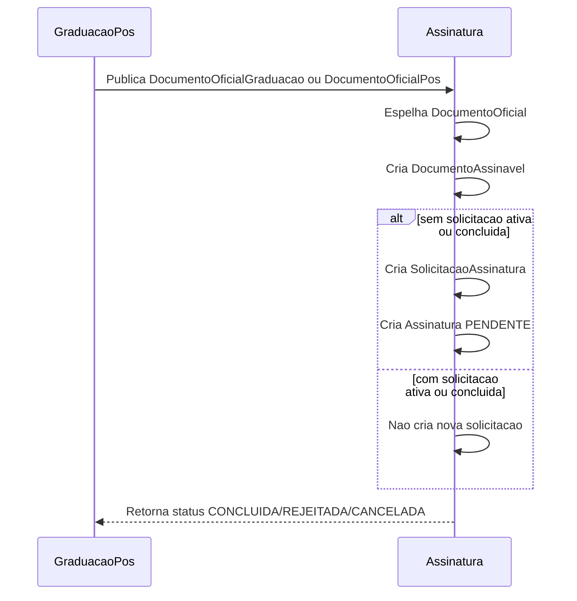

# 3. Cenários de replicação e regras
[← Voltar ao índice](./README.md)

Este documento consolida em um único lugar:
- as regras funcionais de replicação entre domínios;
- os cenários de infraestrutura;
- como DB Based, CDC+Kafka e EDA+Kafka se aplicam em cada cenário.

## 3.1. Taxonomia das replicações
- **Replicações globais (fan-out):** dados que nascem em um ou mais serviços e precisam alimentar todos os consumidores.
- **Replicações de comunicação (cadeia):** dados que transitam de um serviço para outro dentro de um fluxo de negócio.

Regras operacionais:
- Globais: contrato comum de dados, idempotência por `id` + `versao`/`timestamp`, propagação para todos os destinos necessários.
- Comunicação: contrato orientado ao fluxo, confirmação de processamento e retorno de status quando aplicável.

## 3.2. Regras de intersecção (o que replicar)

### 3.2.1 Pessoa (global)
- Usada por todos os serviços.
- Graduação e Pós-graduação produzem; Diplomas e Assinatura consomem read models.
- Criação/atualização deve ser idempotente no destino.

### 3.2.2 Vínculo Acadêmico (global)
- Pessoa pode ter múltiplos vínculos (1:N).
- Graduação e Pós-graduação produzem; Diplomas e Assinatura consomem.
- Mudança para `CONCLUIDO` deve carregar `dataConclusao`.
- Recomendado manter histórico/auditoria das mudanças.

### 3.2.3 Conclusão e elegibilidade (comunicação)
- Diplomas depende de conclusão acadêmica para liberar emissão.
- Conclusão válida exige consistência de status e data.

### 3.2.4 Requerimento e emissão de diploma (comunicação)
- Conclusão gera `RequerimentoDiploma`.
- Emissão gera `Diploma` e `DocumentoDiploma`.
- Resultado da assinatura retorna para atualização de `StatusEmissao`.

### 3.2.5 Assinatura de documentos (comunicação)
- `DocumentoDiploma` e `DocumentoOficial` podem originar `DocumentoAssinavel`.
- `SolicitacaoAssinatura` só abre quando não há solicitação ativa/concluída para o mesmo documento.
- Assinatura concluída gera manifesto e status final; rejeição/cancelamento permite novo ciclo conforme regra do domínio.

## 3.3. Cenários de infraestrutura (onde a replicação roda)

### 3.3.1 Cenário 1 - Simples (mesmo BD e mesmos schemas)
- Sem replicação física entre bancos.
- Ownership lógico entre produtores e consumidores.
- Serve como baseline (`C1A1`) no experimento.

### 3.3.2 Cenário 2 - Schemas (mesmo BD, schemas por serviço)
- Tabelas comuns espelhadas por schema.
- Replicação entre schemas por trigger/procedure, CDC ou eventos.

### 3.3.3 Cenário 3 - Databases (DBs distintos no mesmo servidor)
- Cada serviço com DB próprio.
- Replicação assíncrona com maior necessidade de controle de entrega.

### 3.3.4 Cenário 4 - Servers (DBs em servidores diferentes)
- Mesmo modelo do cenário 3 com maior criticidade de rede/operação.
- Necessário reforço de observabilidade, retry e recuperação.

## 3.4. Arquiteturas por cenário (como replicar)

### 3.4.1 DB Based
- Integração via recursos nativos do PostgreSQL (trigger, procedure, logical replication, jobs).
- Menor latência local, maior acoplamento estrutural.

### 3.4.2 CDC + Kafka
- Captura mudanças de tabela e distribui eventos técnicos.
- Bom desacoplamento de transporte; semântica ainda tabela-cêntrica.

### 3.4.3 EDA + Kafka
- Publicação de eventos de domínio (outbox/inbox).
- Maior autonomia evolutiva; maior disciplina operacional.

### 3.4.4 Matriz resumida
| Cenário | DB Based | CDC+Kafka | EDA+Kafka | Observação |
| --- | --- | --- | --- | --- |
| 1) Simples | Baseline (`C1A1`) | Não executado no experimento | Não executado no experimento | Referência inicial |
| 2) Schemas | Trigger/procedure cross-schema | CDC no schema produtor + apply no schema consumidor | Outbox + consumer por schema | Transição gradual |
| 3) Databases | Logical replication/jobs | CDC no DB produtor + apply no DB consumidor | Outbox/inbox entre DBs | Consistência eventual explícita |
| 4) Servers | Logical replication entre servidores | CDC remoto + apply remoto | Outbox/inbox + broker remoto | Maior estresse operacional |

## 3.5. Regras transversais (todos os cenários)
- Ownership: Graduação/Pós produzem `Pessoa` e `VinculoAcademico`; Diplomas/Assinatura consomem.
- Idempotência: aplicação por `id` + `versao`/`timestamp`.
- Auditoria: rastrear mudanças críticas de vínculo, emissão e assinatura.
- Comparação experimental: sempre comparar arquiteturas dentro do mesmo cenário.

## 3.6. Fluxo funcional consolidado

### 3.6.1 Grad/Pós -> Diplomas
- Conclusão acadêmica válida dispara elegibilidade e requerimento.
- Diplomas emite, gera documento e atualiza status do processo.

### 3.6.2 Diplomas -> Assinatura
- Documento emitido vira documento assinável.
- Solicitação de assinatura abre com regra de não duplicidade ativa/concluída.

### 3.6.3 Assinatura -> Diplomas/Origem
- Conclusão/rejeição/cancelamento retorna para atualização de status e disponibilização.

## 3.7. Técnicas por cenário para preencher `vinculo_academico`
- Cenário 1: trigger/procedure local (sem replicação física).
- Cenário 2: trigger cross-schema, view materializada ou eventos internos.
- Cenário 3: outbox/inbox, CDC por DB ou batch de reconciliação.
- Cenário 4: outbox + broker, CDC streaming e trilha de retry/DLQ.

## 3.8. CDC no PostgreSQL (guia rápido)
- Indicado principalmente para cenários 2, 3 e 4.
- Recomendação padrão: Debezium + logical decoding.
- Checklist mínimo:
  - `wal_level=logical`;
  - publication das tabelas fonte;
  - consumidor aplicando upsert idempotente no destino.

## 3.9. Diagramas de comunicação
Os diagramas abaixo representam a visão lógica consolidada deste documento.

### 3.9.1 Replicações globais (fan-out)

### 3.9.2 Fluxo de diploma (Grad/Pós -> Diplomas -> Assinatura -> retorno)

### 3.9.3 Fluxo de documentos oficiais (Grad/Pós -> Assinatura -> retorno)

