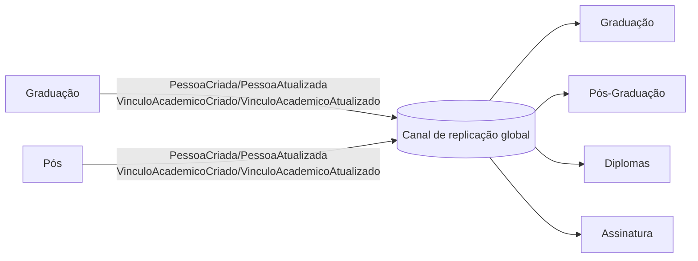
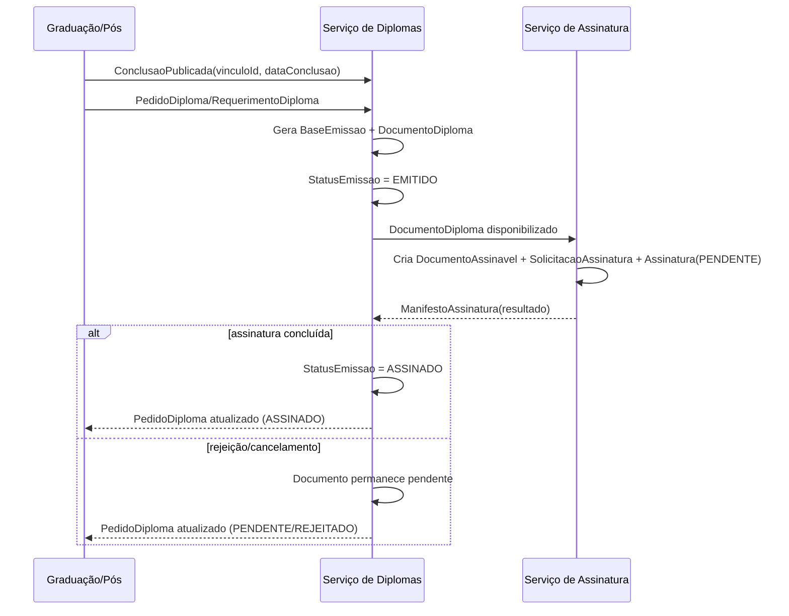
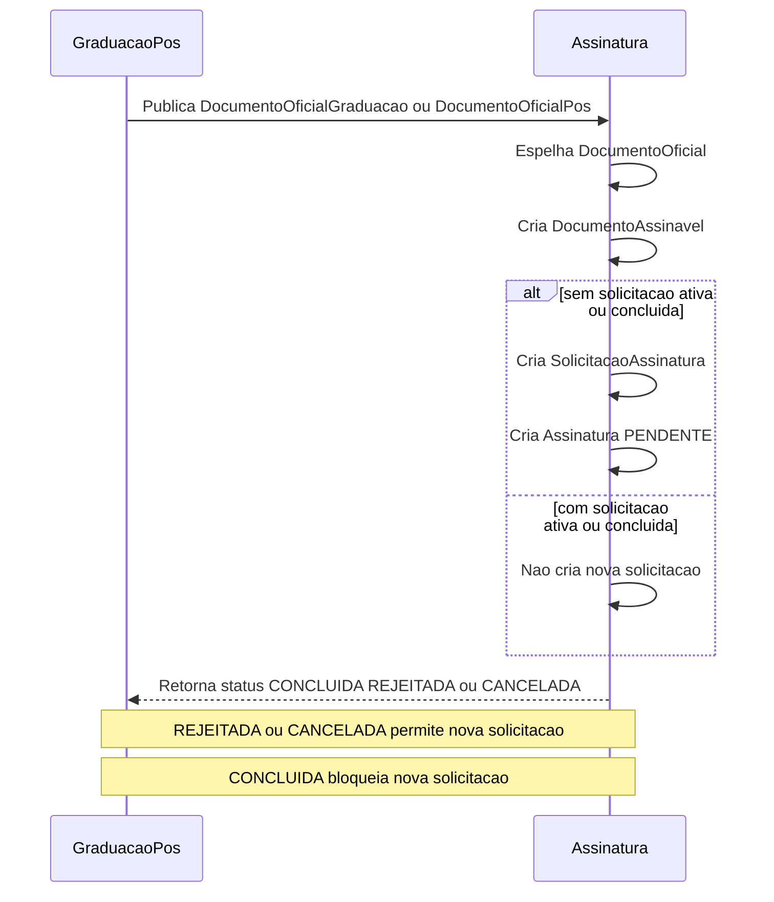

# 3. Definição das intersecções e regras de replicação
[← Voltar ao índice](./README.md)

## 3.0. Taxonomia das replicações (globais e de comunicação)
- Este documento adota dois tipos de replicação: **globais** e **de comunicação**.
- **Replicações globais:** dados que nascem em um ou mais serviços e precisam alimentar todos os demais serviços (padrão fan-out).
- **Replicações de comunicação:** dados que nascem em um serviço e precisam migrar para outro como parte de um fluxo de negócio (cadeia de processo entre serviços).
- **Enquadramento neste documento:** `Pessoa` (3.1) e `VinculoAcademico` (3.2) são replicações globais; seções 3.3 a 3.7 são replicações de comunicação.
- **Regras operacionais por tipo:**
  - Globais: contrato de dados comum, idempotência por `id` + `versao`/`timestamp` e propagação para todos os consumidores.
  - Comunicação: contrato orientado ao fluxo (entrada/saída por etapa), confirmação de processamento e retorno de status quando aplicável.
- **Aplicação nos cenários de replicação:**
  - Cenário 1 (mesmo BD/schema): global com ownership lógico (sem réplica física) e comunicação por tabelas/eventos internos.
  - Cenário 2 (schemas): global com sincronização do produtor para todos os schemas consumidores; comunicação apenas entre os schemas envolvidos no fluxo.
  - Cenário 3 (databases): global e comunicação de forma assíncrona (outbox/inbox), com global em fan-out e comunicação em cadeia.
  - Cenário 4 (servers): mesmo padrão do cenário 3, com reforço de retry, DLQ, observabilidade e reprocessamento.

## 3.1. Pessoa (intersecção principal)
- Pessoa é usada por todos os serviços.
- **Esquema comum:** todos os serviços possuem a mesma entidade e tabela de Pessoa.
- **Fontes de produção:** Graduação e Pós criam e atualizam Pessoa; Diplomas e Assinatura consomem e mantêm cópias locais.
- Regra de criação: Pessoa pode nascer em qualquer um dos dois serviços principais (Graduação ou Pós) e ambos publicam `PessoaCriada`.
- Regra de atualização: Graduação e Pós podem atualizar Pessoa; ambos publicam `PessoaAtualizada`. Consumidores aplicam de forma idempotente (id + timestamp/versão) em seus read models.

## 3.2. Vínculo Acadêmico (VinculoAcademico)
- **Cardinalidade:** uma Pessoa pode ter múltiplos vínculos (1:N), por exemplo duas graduações, um mestrado e um doutorado, cada um com seu próprio `vinculoId`.
- **Histórico:** manter tabela de histórico/versões de `VinculoAcademico` para registrar mudanças de status/curso/orientador (auditoria).
- **Esquema comum:** todos os serviços possuem a mesma entidade e tabela de VínculoAcadêmico (com `cursoId`, `cursoCodigo`, `cursoNome`, `tipoCursoPrograma`).
- **Fontes de produção:** Graduação e Pós criam e atualizam `VinculoAcademico`.
- Eventos: `VinculoAcademicoCriado` (status inicial ativo) e `VinculoAcademicoAtualizado` (mudança de status, curso/programa, orientador/colegiado).
- Consumo: Diplomas e Assinatura mantêm read models; Graduação e Pós também consomem para reconciliação.
- Status “concluído” gera `ConclusaoPublicada` (coberto na seção seguinte).

## 3.3. Conclusão / elegibilidade para diploma
- Diplomas precisa saber quando um vínculo (grad/pós) está concluído.
- Graduação e Pós produzem o estado “concluído” (ou equivalente).
- Diplomas consome esse estado para permitir emissão.
- Regra de consistência: status concluído exige `dataConclusao` preenchida.

## 3.4. Pedido de Diploma (tabela replicada)
- Quando um vínculo é marcado como concluído, Graduação ou Pós cria um registro em uma tabela de `PedidoDiploma` (ou `RequerimentoDiploma`) local.
- Essa tabela é replicada para o serviço de Diplomas, que consome os pedidos e inicia o fluxo de emissão.
- Status e resposta da emissão retornam pelo mesmo caminho lógico: Diplomas atualiza o pedido (ou uma tabela espelho) e replica de volta para os serviços de origem para consulta.

## 3.5. Documento de diploma e assinatura
- Diplomas gera **DocumentoDiploma** automaticamente ao emitir o diploma.
- Assinatura eletrônica cria **DocumentoAssinável** a partir de `DocumentoDiploma` ou de `DocumentoOficial`.
- Solicitação concluída atualiza `StatusEmissao` para `ASSINADO`; rejeição/cancelamento mantém o documento pendente.

## 3.6. Solicitação de Assinatura e Certificados (tabela replicada)
- Ao criar um `DocumentoDiploma` ou `DocumentoOficial`, uma `SolicitacaoAssinatura` é aberta **somente** se não existir solicitação ativa/concluída para o mesmo documento.
- A criação da solicitação gera uma `Assinatura` em `PENDENTE` (pronta para assinar).
- Ao assinar, gera `ManifestoAssinatura`; em caso de rejeição/cancelamento, a solicitação é encerrada e permite nova solicitação futura.
- O resultado (assinatura concluída ou rejeitada) é replicado de volta, permitindo que Diplomas atualize o status do documento e do pedido.

## 3.7. Documentos oficiais (grad/pós → assinatura)
- Graduação e Pós publicam documentos oficiais próprios (`DocumentoOficialGraduacao` / `DocumentoOficialPos`).
- Esses documentos são espelhados em `DocumentoOficial` e viram `DocumentoAssinavel`.
- O fluxo de assinatura segue a mesma regra de criação de solicitação e geração de manifesto.

## 3.8. Diagramas de comunicação
Os diagramas abaixo representam a visão lógica das comunicações definidas neste documento.

### 3.8.1. Replicações globais (fan-out)

### 3.8.2. Comunicação do fluxo de diploma (Grad/Pós → Diplomas → Assinatura → retorno)

### 3.8.3. Comunicação de documentos oficiais (Grad/Pós → Assinatura → retorno)

